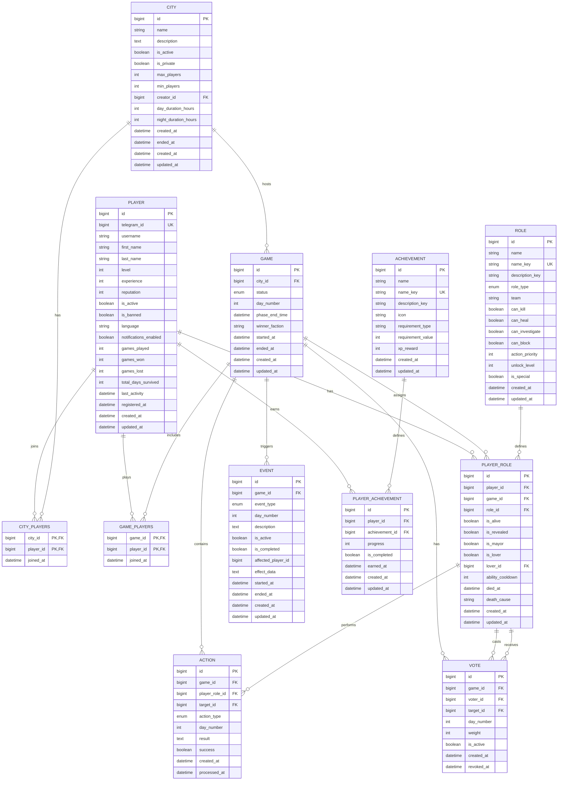

# ER Диаграмма базы данных

## Описание связей

### Player (Игрок)
- **CITY_PLAYERS** (Many-to-Many): Игрок может присоединяться к нескольким городам
- **GAME_PLAYERS** (Many-to-Many): Игрок может участвовать в нескольких играх
- **PLAYER_ROLE** (One-to-Many): Игрок может иметь разные роли в разных играх
- **PLAYER_ACHIEVEMENT** (One-to-Many): Игрок может заработать множество достижений

### City (Город)
- **CITY_PLAYERS** (Many-to-Many): Город имеет множество игроков
- **GAME** (One-to-Many): В городе может быть множество игр
- **PLAYER** (Many-to-One): Город создан одним игроком

### Game (Игра)
- **GAME_PLAYERS** (Many-to-Many): Игра включает множество игроков
- **PLAYER_ROLE** (One-to-Many): В игре назначаются роли игрокам
- **ACTION** (One-to-Many): В игре выполняются ночные действия
- **VOTE** (One-to-Many): В игре проводятся голосования
- **EVENT** (One-to-Many): В игре могут происходить спецсобытия

### Role (Роль)
- **PLAYER_ROLE** (One-to-Many): Шаблон роли используется для назначения игрокам

### PlayerRole (Роль игрока в игре)
- **ACTION** (One-to-Many): Игрок с ролью выполняет действия
- **VOTE** (One-to-Many as voter): Игрок голосует
- **VOTE** (One-to-Many as target): За игрока голосуют

### Achievement (Достижение)
- **PLAYER_ACHIEVEMENT** (One-to-Many): Шаблон достижения зарабатывается игроками
